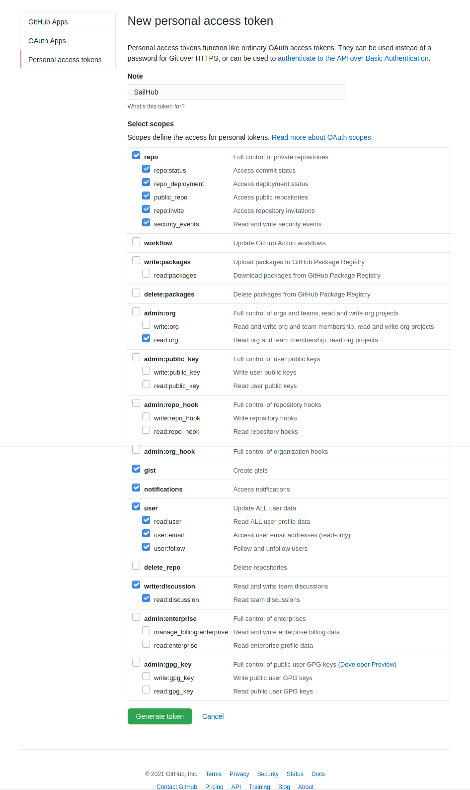

# SailHub
SailHub is an inoffical native GitHub app for Sailfish OS using GitHub GraphQL API (v4).

I made this app to familiarize myself with GraphQL API concepts. GitHub API is well documented and ideal for this purpose.

>

## Current state of development

The development is in an early state at the moment.  
Lot of functionality is missing.

## Authentication with Personal Access Token
To authenticate with GitHub API a personal access token is necessary. You can create one in developer settings on GitHub profile settings page.

## Implemented CRUD Features
Function description: [*C*]reate, [*R*]read, [*U*]pdate, [*D*]elete, [*S*]earch

- Repository [*RS*]
- Organization [*RS*]
- User [*RS*]
- Issue [*CRUD*] + close
- Issue comment [*CRUD*]
- Pull request [*R*]
- Repository files [*R*]
- File content [*R*]

## Implemented Social Features

- Follow / Unfollow user
- Watch / Star repository
- Commenting (Issue)

## Planned Features
- Markdown rendering support for displaying e.g. README.md
- Code highlighting
- Notifications
- Discussion
- Some useful cover action /content
- Feature requests (any ideas are welcome!)
- ...

## Translations
Available translations:

- English
- German
- Polish (by [atlochowski](https://github.com/atlochowski))
- Chinese (by [dashinfantry](https://github.com/dashinfantry))
  
If you missing your native language you are welcome to support this project with your translation.

[https://weblate.nubecula.org/engage/harbour-sailhub/](https://weblate.nubecula.org/engage/harbour-sailhub/)

## Testing
If you like to test the functionality you can use my dummy repository:

[black-sheep-dev/dumm-repo](https://github.com/black-sheep-dev/dummy-repo)

## Donations

If you like my work, you can buy me a beer! 

